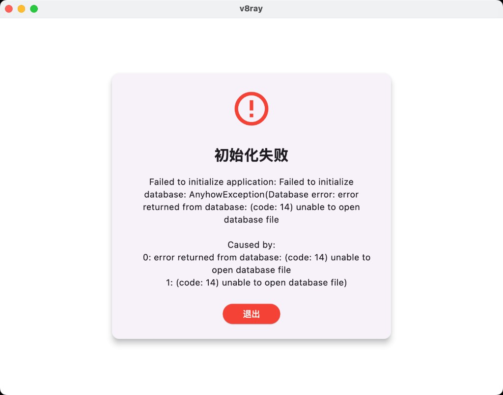

# 需求说明

## 1. 本次变更概述

本轮发布 **v0.2.12**。macOS 启动出现“初始化失败 / SQLite code 14 unable to open database file”；需要 GitHub 自动构建，并能够通过 tag 触发构建与发布。

## 2. 功能需求

### 2.1 页面与入口

- 应用启动后应进入正常主界面，而不是卡在初始化失败对话框。

### 2.2 交互行为

- 启动失败时现有“退出”对话框可保留，但数据库应能在可写目录中创建，不应因写入 `.app` 包而失败。

### 2.3 数据、协议与解析

- 订阅数据库文件名：`v8ray_subscriptions.db`。
- 数据库应写入系统应用数据目录（macOS Application Support / Windows AppData / Linux `~/.local/share`），不得写入 `.app/Contents/MacOS/` 或不可写的安装目录。
- 若可执行文件旁仍有旧数据库，启动时应迁移到新路径。

### 2.4 性能与资源约束

无新增性能指标。

### 2.5 兼容性与异常场景

#### macOS 启动数据库失败

- **现状/问题**：macOS 打开应用后弹出“初始化失败”，错误为 `Failed to initialize database`，SQLite `(code: 14) unable to open database file`。
- **目标行为**：启动时能成功打开或创建订阅数据库，进入应用。
- **约束与边界**：macOS App Sandbox 下不可向应用包内写文件。
- **验收标准**：在 macOS 上启动不再出现该初始化失败对话框。
- **证据**：

#### GitHub 自动构建

- **现状/问题**：需要 GitHub 自动构建能力。
- **目标行为**：代码变更后可自动构建桌面端产物；推送 tag 必须能触发构建。
- **约束与边界**：tag 触发不能被路径过滤掉；构建 Linux / Windows / macOS；tag 构建应发布 GitHub Release。
- **验收标准**：`git push origin <tag>` 后 Actions 中 Build workflow 运行，产物可下载；tag 构建发布 Release。

#### 版本升级、提交、打 tag、推送

- **目标行为**：版本升级到 `0.2.12`，提交代码，打 tag 并推送到远程。
- **验收标准**：远程 `main` 含本次提交，存在 tag `v0.2.12`。

## 3. UI 展示与视觉要求

无新增界面设计。启动失败对话框为既有错误页，修复目标是不再出现该 SQLite 错误。

## 4. 明确不做 / 已撤销事项

- 不把本机构建生成的 `core/bin/.xray_download_info` 作为发布内容提交。
- 不提交 `.specstory/`、`.cursorindexingignore` 等本地工具文件。

## 5. 验收标准

- macOS 启动不再因 SQLite code 14 弹出初始化失败。
- 推送 tag 触发 GitHub Build，上传 Linux / Windows / macOS 产物，并创建 GitHub Release。
- 版本号为 `0.2.12`，tag `v0.2.12` 已推送。

## 6. 参考截图

- 
  证明启动时数据库文件无法打开。
