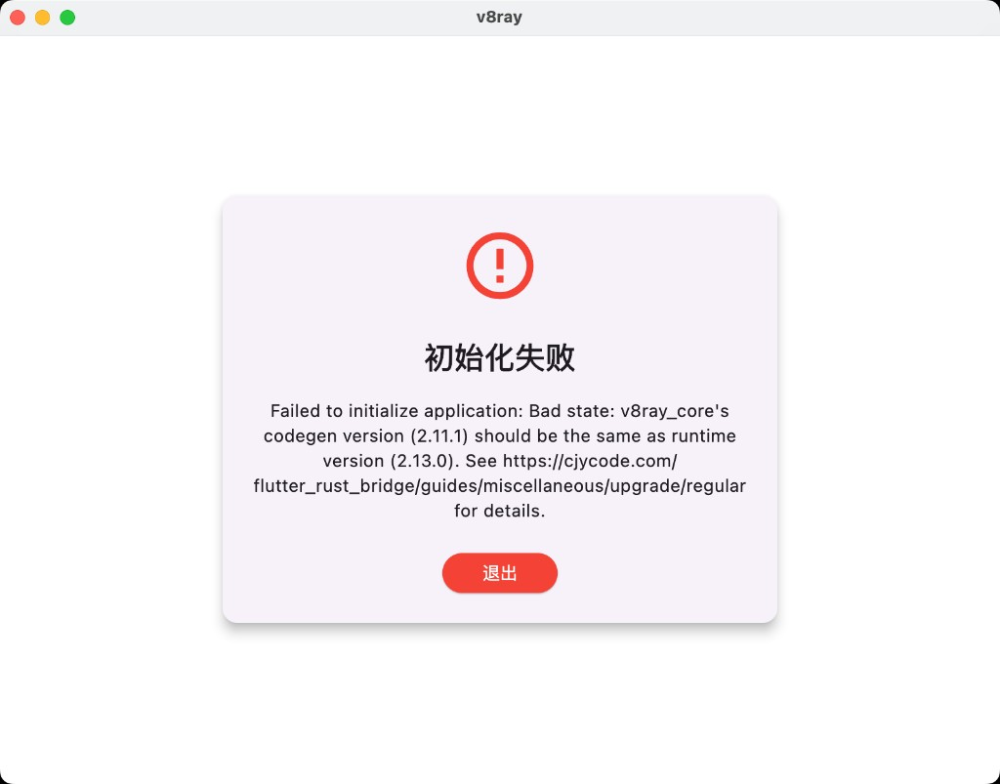

# 需求说明

## 1. 本次变更概述

当前发布 **v0.2.13**。在 v0.2.12 数据库与 tag 自动构建之上，锁定 Flutter Rust Bridge 2.11.1，并向 GitHub Release 增加 macOS arm64 产物。

## 2. 功能需求

### 2.1 页面与入口

- 应用启动后应进入正常主界面，而不是卡在初始化失败对话框。

### 2.2 交互行为

- 启动失败时现有“退出”对话框可保留，但数据库应能在可写目录中创建，不应因写入 `.app` 包而失败。
- Flutter Rust Bridge 生成代码与运行时版本必须一致，否则启动失败。

### 2.3 数据、协议与解析

- 订阅数据库文件名：`v8ray_subscriptions.db`。
- 数据库应写入系统应用数据目录（macOS Application Support / Windows AppData / Linux `~/.local/share`），不得写入 `.app/Contents/MacOS/` 或不可写的安装目录。
- 若可执行文件旁仍有旧数据库，启动时应迁移到新路径。

### 2.4 性能与资源约束

无新增性能指标。

### 2.5 兼容性与异常场景

#### macOS 启动数据库失败

- **现状/问题**：macOS 打开应用后弹出“初始化失败”，错误为 `Failed to initialize database`，SQLite `(code: 14) unable to open database file`。
- **目标行为**：启动时能成功打开或创建订阅数据库，进入应用。
- **约束与边界**：macOS App Sandbox 下不可向应用包内写文件。
- **验收标准**：在 macOS 上启动不再出现该初始化失败对话框。
- **证据**：
- **当前实现/验证状态**：v0.2.12 已改数据目录。

#### Flutter Rust Bridge 版本不一致

- **现状/问题**：启动弹出“初始化失败”，`v8ray_core's codegen version (2.11.1) should be the same as runtime version (2.13.0)`。
- **目标行为**：Dart 运行时、Rust crate、生成代码均为 `2.11.1`，启动不再因 FRB 版本检查失败。
- **约束与边界**：`pubspec.yaml` 与 `Cargo.toml` 均需钉死版本，不能使用 `^2.11.0` / `"2.11"` 这类会升到 2.13 的约束。
- **验收标准**：启动不再出现 codegen/runtime 版本不一致对话框。
- **证据**：

#### GitHub 自动构建与 macOS arm64 发布

- **现状/问题**：需要 GitHub 自动构建；需要增加 macOS arm64 发布包。
- **目标行为**：推送 tag 触发构建并发布 GitHub Release；Release 包含 `v8ray-macos-arm64.tar.gz`；Apple Silicon 自动更新匹配 `macos-arm64`。
- **约束与边界**：tag 触发不能被路径过滤掉；macOS arm64 使用 `aarch64-apple-darwin` 并校验架构。
- **验收标准**：`git push origin <tag>` 后 Build workflow 运行；Release 可下载 Linux x64、Windows x64、macOS arm64。

#### 版本升级、提交、打 tag、推送

- **目标行为**：版本升级到 `0.2.13`，提交代码，打 tag 并推送到远程。
- **验收标准**：远程 `main` 含本次提交，存在 tag `v0.2.13`。

## 3. UI 展示与视觉要求

无新增界面设计。启动失败对话框为既有错误页，修复目标是不再出现 SQLite / FRB 版本错误。

## 4. 明确不做 / 已撤销事项

- 不把本机构建生成的 `core/bin/.xray_download_info` 作为发布内容提交。
- 不提交 `.specstory/`、`.cursorindexingignore` 等本地工具文件。
- 本轮不把 FRB 升级到 2.13.0，只钉死 2.11.1。

## 5. 验收标准

- macOS 启动不再因 SQLite code 14 或 FRB 2.11.1/2.13.0 不一致弹出初始化失败。
- 推送 tag 触发 GitHub Build，发布包含 `v8ray-macos-arm64.tar.gz` 的 GitHub Release。
- 版本号为 `0.2.13`，tag `v0.2.13` 已推送。

## 6. 参考截图

- 
- 
