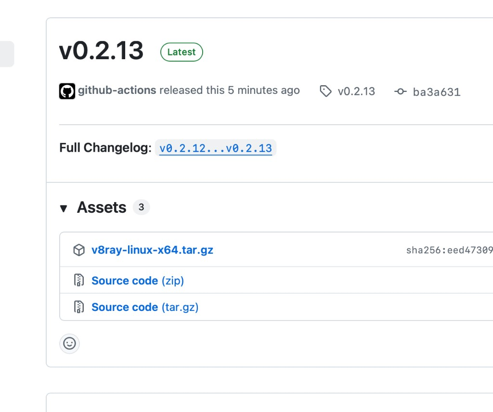

# 提交需求历史

## 2026-09-11 15:02 · 修复 macOS arm64 CI 本机构建

- **提交范围**：`macos-latest` 改为本机 cargo 构建，去掉 `--target aarch64-apple-darwin`；打包仍用 `lipo` 校验 arm64；版本升级到 `0.2.14`。
- **用户需求**：
  - v0.2.13 新修改的 arm64 mac 打包失败，Release 只有 Linux 包。
  - 升级版本、提交、打 tag、推送。
- **需求修正/撤销**：不再对 macOS arm64 使用显式 Rust `--target`。
- **验收结果**：本地 `cargo build --lib --target aarch64-apple-darwin`（debug）可通过；CI 失败发生在 Pre-build Rust library。修复后的 GitHub Actions 待推送 tag 后确认。
- **关联图片**：
- **代码提交**：待提交

## 2026-09-11 14:40 · 锁定 FRB 2.11.1 并发布 macOS arm64

- **提交范围**：钉死 Flutter Rust Bridge 2.11.1；GitHub Release 增加 `v8ray-macos-arm64`；Apple Silicon 自动更新匹配 arm64；版本升级到 `0.2.13`。
- **用户需求**：
  - 说明并处理启动时报 codegen 2.11.1 / runtime 2.13.0 不一致。
  - Cargo.toml 也要指定 FRB 版本。
  - 增加 macOS arm64 发布。
  - 升级版本、提交、打 tag、推送。
- **需求修正/撤销**：不升级到 FRB 2.13.0，三边钉死 2.11.1。
- **验收结果**：未在本地执行 `flutter pub get`（环境无 Flutter）。GitHub Actions 与 macOS 启动待推送 tag 后确认。
- **关联图片**：
- **代码提交**：待提交

## 2026-09-11 14:01 · 修复 macOS 数据库初始化并支持 tag 自动构建

- **提交范围**：将订阅数据库改到系统应用数据目录；新增 GitHub Build workflow（tag 触发构建并发布 Release）；版本升级到 `0.2.12`。
- **用户需求**：
  - 修复 macOS 启动“初始化失败 / SQLite code 14 unable to open database file”。
  - 增加 GitHub 自动构建。
  - 可以通过 tag 触发构建。
  - 升级版本、提交、打 tag、推送。
- **需求修正/撤销**：无。tag 触发从仅 `v*` 调整为任意 tag，并避免与 `paths` 过滤冲突。
- **验收结果**：`cargo test --lib subscription::storage` 通过（8 passed）。macOS 启动路径与 GitHub Actions 实际跑通情况待用户在推送后确认。
- **关联图片**：
- **代码提交**：待提交
